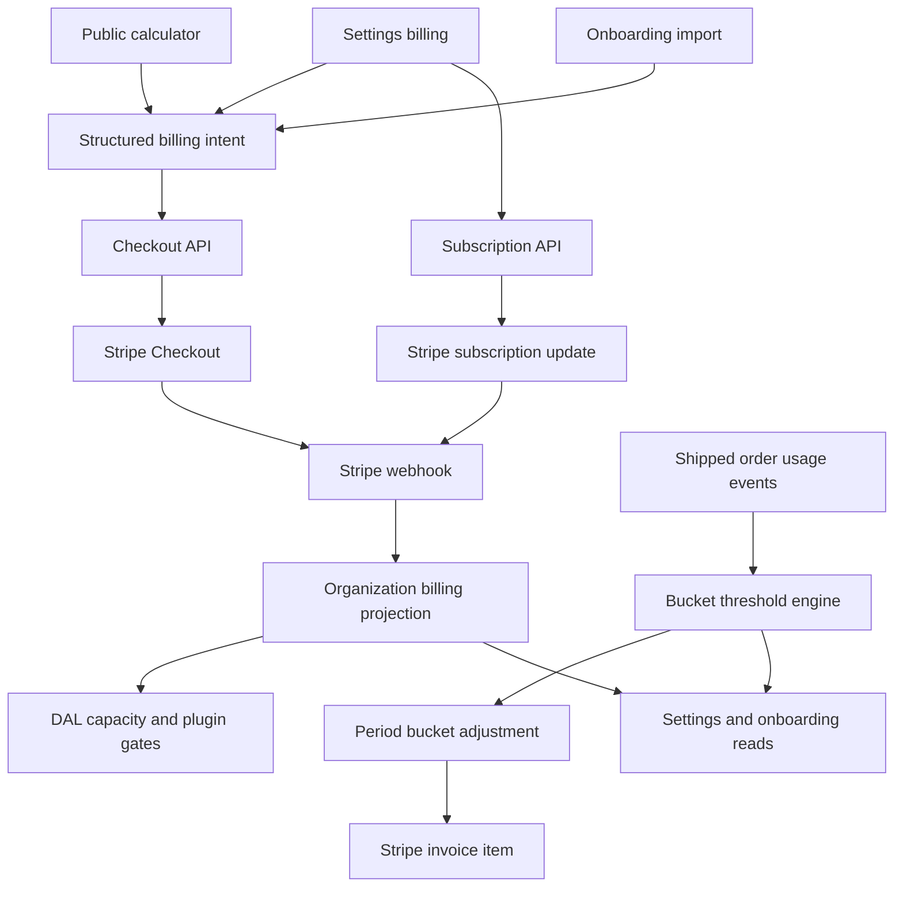
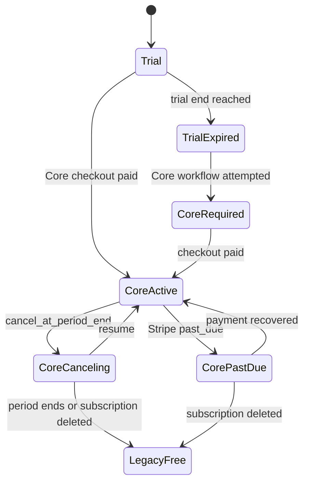
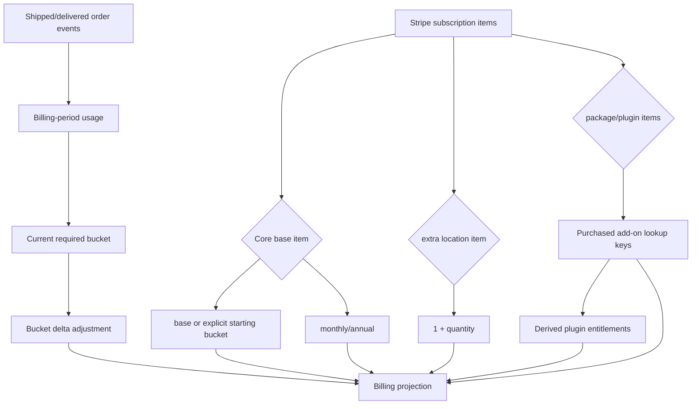

# feat: Harden volume and location billing architecture

## Summary

Modify the current pricing PR so the backend models the public calculator as a durable subscription contract: free trial as the public entry point, Core as the required paid base, shipped/delivered sales-order usage that promotes customers between price buckets, additional locations as Stripe quantities, and add-ons as subscription items that derive plugin entitlements.

---

## Problem Frame

The current PR moves the product away from a `30 SKU` public free tier and toward a free trial plus Core pricing. It has the right direction, but it still carries plugin-era shapes in important places: checkout accepts one lookup key, add-ons can start a package-only subscription, location quantity is persisted but not mapped from Stripe, order volume is checked against active order count rather than shipped/delivered order usage, onboarding still defaults some paths to `free`, and `billingAddons` stores expanded plugins rather than the purchased add-on products.

The long-term architecture should separate commercial subscription state from operational usage. Stripe subscription items should own Core base, locations, interval, and add-ons. The app should own an internal usage meter that records shipped/delivered orders for the billing period, then creates a bucket adjustment charge when usage crosses a threshold. The public site should never generate a plan intent the app cannot reconstruct.

---

## Requirements

### Product Contract

- R1. Public signup must default to a time-boxed free trial, not a `30 SKU` free tier.
- R2. Core must be the paid base plan for self-serve billing; plugin/package add-ons cannot create a paid subscription without Core.
- R3. Sales-order volume must be counted from shipped/delivered orders and charged in buckets, not as a visible per-order meter.
- R4. Additional locations must be represented as purchased capacity, with one location included in Core.
- R5. Add-ons must preserve package/plugin purchase identity while still deriving the existing plugin entitlement set.

### Billing Architecture

- R6. Checkout and subscription APIs must accept structured billing selections rather than a single `lookupKey`.
- R7. Stripe subscription items must map deterministically into `plan`, `billingInterval`, starting bucket, `locationCapacity`, purchased add-ons, plugin entitlements, and period dates.
- R8. Sales-order capacity enforcement must use a billing-period usage definition, not active all-time order count.
- R9. Billing gates must remain in DAL transactions so stale clients, Android, integrations, and agents share one enforcement path.
- R10. Existing plugin/package subscribers must have a safe migration or grandfathering policy before capacity enforcement blocks production orgs.
- R15. Annual billing must be implemented as the selected annual band price promised by the public calculator.
- R16. Crossing a bucket threshold must update billing predictably, with idempotent period bucket adjustments and customer-visible state.
- R17. Bucket upgrades apply to the full billing period once the threshold is crossed; the customer pays the selected period's bucket price, not a prorated partial-period price.

### Client and Operations

- R11. Settings billing must show the current Core band, interval, location capacity, purchased add-ons, usage, and Stripe-management actions from the backend read model.
- R12. Onboarding import approval must treat trial eligibility and paid Core eligibility as first-class states, with no SKU cap branch in the active launch path.
- R13. Public Astro calculator CTAs must encode enough state for the app to start the matching Core checkout selection, or route custom selections to sales.
- R14. Android must not require changes for this PR unless an existing Android mutation can newly receive a billing `402`.

---

## Key Technical Decisions

- KTD1. Free trial is the launch default; `free` remains only as legacy/internal compatibility. This avoids SKU-cap enforcement across agentic import and every item creation path.
- KTD2. Use structured selections at app boundaries. A typed selection object prevents package-only checkout and carries band, interval, location capacity, and add-ons together.
- KTD3. Keep the recurring Core subscription stable and charge bucket deltas as period adjustments. This matches "starts at $299 each month" and avoids reset/proration ambiguity.
- KTD4. Persist purchased add-on lookup keys separately from expanded plugin entitlements. Package identity matters for invoices, settings UI, and future subscription changes; plugin entitlements are the derived access layer.
- KTD5. Track shipped/delivered sales orders as idempotent billable events. Active all-time order count is not equivalent to monthly order volume and will create incorrect bucket changes.
- KTD6. Keep Stripe as payment truth, but keep app-owned projected subscription state and period adjustment state. Webhooks, resync, and checkout return flows update the subscription projection; shipped-order usage creates app-owned period adjustments that are pushed to Stripe exactly once.
- KTD7. Capacity enforcement uses launch controls and grandfathering. The current plugin-enforcement model should be extended or mirrored for capacity so existing orgs are not unexpectedly locked.
- KTD8. Follow Katana's usage basis but bucket the billing. Ashicore should track actual shipped/delivered order usage, then bill by bucket so customers do not feel each individual order changes price.
- KTD9. Do not use subscription price swaps for automatic bucket crossing. Full-period bucket charging is clearer as a one-time invoice item for the bucket delta already incurred in that period.

---

## High-Level Technical Design

---

## Implementation Units

### U1. Replace single lookup-key intents with structured billing selections

**Goal:** Make plan intent, checkout, and subscription change APIs carry a complete commercial selection instead of one catalog lookup key.

**Requirements:** R2, R3, R4, R5, R6, R13

**Dependencies:** None

**Files:**

- `lib/billing/types.ts`
- `lib/billing/plan-intent.ts`
- `app/api/billing/checkout/route.ts`
- `app/api/billing/subscription/route.ts`
- `components/signup-form.tsx`
- `components/org-setup-form.tsx`
- `app/(auth)/sign-up/page.tsx`
- `app/(auth)/org-setup/page.tsx`
- `test/e2e/fast/billing-entitlements.spec.ts`

**Approach:** Introduce a `BillingSelection` shape with `mode: trial | core`, `band`, `interval`, `locationCapacity`, and `addonLookupKeys`. Keep `plan=core` and existing lookup-key URLs as backward-compatible inputs that normalize into the structured selection. Update checkout and subscription schemas to reject add-on-only paid selections.

**Patterns to follow:** Existing Zod route validation in `app/api/billing/checkout/route.ts`; current normalization in `lib/billing/plan-intent.ts`; idempotency handling in billing routes.

**Test scenarios:**

- Given `plan=trial`, signup persists a trial selection and does not create a paid checkout intent.
- Given `plan=core`, signup normalizes to Core starter monthly, one included location, and no add-ons.
- Given a Core selection with Growth annual and two locations, checkout receives the same band, interval, and capacity values.
- Given a checkout request with add-ons but no Core base, the API returns `400` and creates no Stripe session.
- Given an old plugin lookup key in an onboarding session, normalization maps it to Core starter plus that add-on or rejects it with a clear fallback policy.

**Verification:** No public or authenticated entry point can request a package-only subscription.

### U2. Rework the catalog around commercial items and derived entitlements

**Goal:** Separate commercial subscription items from feature-access entitlements.

**Requirements:** R2, R5, R7

**Dependencies:** U1

**Files:**

- `lib/billing/types.ts`
- `scripts/stripe-create-catalog.ts`
- `docs/billing.md`
- `test/e2e/fast/billing-entitlements.spec.ts`

**Approach:** Define catalog item kinds for `core_band`, `extra_location`, `package`, and `plugin`. Keep lookup keys as stable app-owned identifiers. Store package/plugin add-on lookup keys as purchased products, then derive `organization.entitlements` from those add-ons for existing gates.

**Patterns to follow:** Existing `BILLING_PRICE_LOOKUP_PLUGINS`; Stripe catalog script metadata and idempotent lookup-key creation.

**Test scenarios:**

- Given a Core Growth annual lookup key, the catalog identifies it as a Core band with annual interval and Growth capacity.
- Given a location add-on lookup key and quantity `3`, the projection produces `locationCapacity = 4` when Core includes one location.
- Given `package_food_bev`, the projection records `package_food_bev` as purchased and derives lot tracking, batch production, and wholesale pricing entitlements.
- Given `plugin_crm`, the projection records `plugin_crm` as purchased and derives only CRM entitlement.
- Given the catalog script runs twice, lookup keys remain stable and no duplicate active prices are created.

**Verification:** Invoices and UI can explain what was purchased without reverse-engineering expanded plugin entitlements.

### U3. Map Stripe subscription items into the app billing projection

**Goal:** Make webhook/resync state projection complete for Core base, starting bucket, interval, location quantity, add-ons, entitlements, and period data.

**Requirements:** R4, R5, R7, R10

**Dependencies:** U2

**Files:**

- `lib/billing/stripe.ts`
- `lib/billing/dal.ts`
- `lib/db/schema/auth.ts`
- `drizzle/`
- `test/e2e/fast/billing-entitlements.spec.ts`

**Approach:** Add durable fields for purchased add-on lookup keys and, if needed, raw subscription item lookup/quantity snapshots for auditability. In `stateFromSubscription`, require one Core item for active Core state, derive interval and starting bucket from it, derive extra location quantity from the location item, derive purchased add-ons from package/plugin items, and clear projected paid access on canceled/deleted subscriptions according to the launch policy.

**Patterns to follow:** Existing `stateFromSubscription`, stale-event protection, and webhook fallback tests.

**Test scenarios:**

- Given active subscription items for Core annual, two extra locations, and Food & Bev, webhook persists `plan=core`, `billingInterval=annual`, starting bucket, `locationCapacity=3`, purchased add-ons, and derived plugin entitlements.
- Given an active subscription with add-ons but no Core item, webhook does not mark the org Core and records an error path for manual correction.
- Given a subscription update removes an add-on, derived entitlements remove only plugins no longer granted by any remaining package/plugin.
- Given a deleted subscription event for the current subscription, paid access is cleared and the org falls back to the chosen legacy/free/trial post-subscription state.
- Given a stale deleted event for an old subscription ID, the current subscription projection is unchanged.

**Verification:** Stripe is the only commercial writer, and projected app state can be rebuilt from subscription items.

### U4. Implement shipped-order usage events and bucket thresholds

**Goal:** Replace active all-time sales-order count enforcement with shipped/delivered order usage that determines the required billing bucket.

**Requirements:** R3, R8, R9

**Dependencies:** U3

**Files:**

- `lib/billing/usage.ts`
- `lib/billing/buckets.ts`
- `lib/billing/entitlements.ts`
- `lib/db/schema/sales.ts`
- `lib/db/schema/auth.ts`
- `lib/db/schema/billing.ts`
- `drizzle/`
- `docs/billing.md`
- `test/e2e/fast/billing-entitlements.spec.ts`

**Approach:** Define the launch metric as shipped/delivered sales orders during the current billing period. Record an idempotent usage event the first time an order reaches the billable state, keyed by org, sales order, and billing period. Use the period event count to compute the required bucket. Keep all-time active order count out of billing enforcement.

**Patterns to follow:** Existing period-end persistence in billing projection; sales order shipping/status transition code; idempotent inventory operation patterns.

**Test scenarios:**

- Given an order is created but not shipped/delivered, it does not count toward the bucket.
- Given an order is shipped/delivered for the first time, one billing-period usage event is recorded.
- Given the same order is saved or shipped again, no duplicate usage event is recorded.
- Given usage before `currentPeriodStart`, current period usage excludes it.
- Given a Core Starter org crosses the Starter threshold, the required bucket becomes Growth.
- Given the billing period rolls forward via webhook/resync, usage for the new period resets without deleting historical usage events.

**Verification:** Bucket movement follows shipped/delivered usage while invoices remain bucketed.

### U5. Add threshold-driven bucket adjustment charges

**Goal:** Charge the period's bucket delta when usage crosses a threshold, without changing the recurring base subscription or creating duplicate charges.

**Requirements:** R3, R6, R7, R16, R17

**Dependencies:** U3, U4

**Files:**

- `lib/billing/stripe.ts`
- `lib/billing/buckets.ts`
- `lib/billing/dal.ts`
- `lib/db/schema/billing.ts`
- `lib/sales/queries/order-write.ts`
- `app/api/billing/resync/route.ts`
- `test/e2e/fast/billing-entitlements.spec.ts`

**Approach:** After a billable shipped/delivered usage event is recorded, compute the required bucket for the period. If the required bucket is above the already-charged period bucket, persist a period bucket adjustment row for the delta between buckets and create a Stripe invoice item or invoice for that delta with an idempotency key. Do not change the recurring Core subscription item for automatic usage bucket movement. At the next billing period, the required bucket starts from the configured starting bucket again.

**Patterns to follow:** Existing Stripe customer lookup, idempotency-key patterns, webhook projection, and founder alert logging.

**Test scenarios:**

- Given usage crosses from Starter to Growth, one period adjustment is recorded for the Growth-minus-Starter delta.
- Given the Starter-to-Growth threshold is crossed halfway through the billing period, the adjustment charges the full period bucket delta, not a prorated delta.
- Given the threshold check retries after a network failure, the idempotency key prevents duplicate invoice items.
- Given usage remains in the current bucket, no adjustment is recorded.
- Given a new billing period starts, the org returns to the base Core bucket unless it has an explicit higher starting bucket.
- Given the current subscription is canceled or missing, threshold processing records the required bucket and pending adjustment state but does not call Stripe.

**Verification:** Price increases happen at bucket thresholds, not per order, and the charge path is idempotent.

### U6. Harden capacity gates and launch controls

**Goal:** Keep operational gates correct and controllable during rollout without blocking sales workflows on bucket billing.

**Requirements:** R8, R9, R10, R14

**Dependencies:** U3, U4, U5

**Files:**

- `lib/billing/entitlements.ts`
- `lib/sales/queries/order-write.ts`
- `lib/inventory/queries/locations.ts`
- `lib/env.ts`
- `docs/billing.md`
- `test/e2e/fast/billing-entitlements.spec.ts`

**Approach:** Split plugin-gate rollout from location/trial capacity rollout. Sales-order bucket movement should bill or queue a billing adjustment rather than block order creation or shipment. Location capacity and expired-trial Core requirements may still block expansion writes. Fail closed for expected location/trial denials, fail open only for unexpected errors, and log gate hits with dimension, limit, current usage, and route.

**Patterns to follow:** Existing plugin gate shadow logging, founder alert scheduling, and DAL transaction placement.

**Test scenarios:**

- Given bucket adjustment delivery fails, the sales workflow still succeeds and the adjustment remains pending for retry.
- Given location capacity enforcement is off, an over-location org is shadow-logged and location create succeeds.
- Given location capacity enforcement is on and the org is not grandfathered, over-capacity location creation throws `BillingCapacityError`.
- Given an unexpected billing read error, creation fails open and captures observability context.
- Given a location capacity of one and one active location, creating another location blocks; deleting or editing existing locations remains available.

**Verification:** Location/trial enforcement can start in shadow mode and move to enforcement without making sales operations depend on synchronous Stripe success.

### U7. Align onboarding with trial/Core states

**Goal:** Remove active `free` defaults from onboarding and make import commit rules reflect trial eligibility and Core payment status.

**Requirements:** R1, R2, R12

**Dependencies:** U1, U3, U6

**Files:**

- `app/(onboarding)/onboarding/onboarding-import-page.tsx`
- `app/api/onboarding/imports/[id]/approve/route.ts`
- `app/api/onboarding/imports/[id]/finalize/route.ts`
- `lib/onboarding/session.ts`
- `lib/db/schema/onboarding-imports.ts`
- `test/e2e/slow/onboarding-import.spec.ts`

**Execution note:** Start with a scratch onboarding import test for trial commit and expired-trial Core-required commit before changing route logic.

**Approach:** Default onboarding selection to trial. Let active trial imports commit without Stripe payment regardless of SKU count. For Core-selected or expired-trial states, start structured Core checkout and finalize after the Core projection is active. Remove `30 SKU` branches from active code paths unless product explicitly reopens that requirement.

**Patterns to follow:** Existing approve/finalize split and webhook-lag retry behavior.

**Test scenarios:**

- Given no plan query, onboarding starts as trial.
- Given an active trial and an import with more than 30 SKUs, approve commits successfully.
- Given an expired trial and no Core subscription, approve returns a billing `402` before import commit.
- Given Core checkout returns before the webhook, finalize resyncs Stripe and then commits when projection is active.
- Given payment is canceled, no import commit occurs and the user can retry checkout.

**Verification:** Agentic data loading is not blocked by SKU count during trial.

### U8. Make settings billing manage Core capacity, not only plugins

**Goal:** Let settings display and change the same Core selections the public calculator sells.

**Requirements:** R3, R4, R5, R11, R16

**Dependencies:** U1, U2, U3, U4

**Files:**

- `app/(dashboard)/settings/types.ts`
- `app/(dashboard)/settings/billing/page.tsx`
- `app/(dashboard)/settings/billing-section.tsx`
- `lib/billing/dal.ts`
- `test/e2e/fast/billing-entitlements.spec.ts`

**Approach:** Replace the plugin-first settings copy with Core-first sections: trial/Core status, order band, current period orders, location capacity, purchased add-ons, and manage actions. Subscription changes should call structured subscription actions for band, location capacity, and add-on set. Keep Stripe portal for payment method and invoice management.

**Patterns to follow:** Existing settings billing action state and `apiJson` error handling.

**Test scenarios:**

- Given a trial org, settings shows trial end, usage, and a Start Core action.
- Given a Core org, settings shows current bucket, billing interval, shipped/delivered orders this period, next threshold, location capacity, and purchased add-ons.
- Given usage crosses into a higher bucket, settings shows the required period bucket and charged adjustment state.
- Given a Core org changes from Starter to Growth, the API receives a structured band change and settings refreshes after success.
- Given a Core org increases location capacity, the API updates the Stripe quantity and settings reflects the projected capacity after webhook/resync.
- Given an add-on is purchased through a package, settings shows the package as purchased rather than only individual plugin entitlements.

**Verification:** Settings can explain and manage the actual subscription composition.

### U9. Encode calculator selections in the public Astro site

**Goal:** Make calculator CTAs produce backend-supported billing selections or route custom cases to sales.

**Requirements:** R1, R3, R4, R5, R13

**Dependencies:** U1

**Files:**

- `apps/www/src/lib/pricing.ts`
- `apps/www/src/pages/pricing.astro`
- `apps/www/src/pages/index.astro`
- `apps/www/src/layouts/BaseLayout.astro`
- `apps/www/src/styles/global.css`

**Approach:** Keep free-trial copy. For self-serve Core selections, encode band, interval, location capacity, and add-ons into signup query params the app normalizes. For Scale/custom order bands, route to sales. Avoid sending `plan=core` alone when the user has selected Growth, Pro, extra locations, or add-ons.

**Patterns to follow:** Existing Astro calculator state rendering and analytics attributes.

**Test scenarios:**

- Given Starter monthly with one location and no add-ons, CTA URL normalizes to Core starter monthly.
- Given Growth annual with two locations, CTA URL carries Growth, annual, and location capacity.
- Given Food & Bev package selected, CTA URL includes that purchased add-on.
- Given Scale order volume, CTA routes to sales instead of signup.
- Given any trial CTA, CTA URL carries trial intent and not legacy `free`.

**Verification:** The public pricing page cannot create an unsupported onboarding or checkout state.

### U10. Define migration, compatibility, and Android impact

**Goal:** Make the PR safe for existing orgs and non-web clients.

**Requirements:** R10, R14

**Dependencies:** U3, U5

**Files:**

- `docs/billing.md`
- `docs/production-ops.md`
- `docs/testing.md`
- Sibling repo `erp-android` impact notes only if code changes become necessary

**Approach:** Document how existing plugin/package subscribers map into Core or stay grandfathered. Record capacity-enforcement launch steps, Stripe catalog rollout, and public-site release ordering. Re-check Android after final route changes; current Android does not create sales orders or locations and generic API error parsing can surface a billing `402`.

**Patterns to follow:** Current production Stripe checklist and Android API-error guidance.

**Test scenarios:** Test expectation: none -- migration policy and Android impact are reviewed against docs and route inventory unless Android code changes are required.

**Verification:** Launch sequencing is clear before the public pricing promise changes.

---

## Scope Boundaries

### In Scope

- Convert the current PR from lookup-key-centered billing to structured Core selections.
- Keep free trial as the public launch path.
- Add Stripe-backed location quantity support.
- Add shipped/delivered sales-order usage events, bucket thresholds, and idempotent bucket adjustment charges before enforcement.
- Preserve current plugin entitlement gates as the derived add-on access layer.
- Align onboarding, settings, and public Astro CTAs to the same backend contract.

### Deferred to Follow-Up Work

- Retiring `organization.entitlements` after every plugin gate reads a richer add-on model.
- Self-serve custom Scale pricing; route Scale to sales for this PR.
- Revenue analytics, plan conversion dashboards, and customer-facing invoice history beyond Stripe portal.
- A revived `30 SKU` free tier. That is a separate SKU-cap enforcement project across import and item creation seams.

---

## System-Wide Impact

- **Billing:** Stripe subscription items remain the commercial source of truth for subscribed products; app usage events decide when a period bucket adjustment is required.
- **Sales:** Shipping/delivery becomes a billing usage source; creation stays free of order-volume billing side effects unless product later chooses create-time counting.
- **Inventory:** Location creation changes from binary `multi_location` entitlement to numeric purchased capacity.
- **Onboarding:** Trial import commit becomes the default; paid commit waits for Core projection only when the trial has expired or the user explicitly chose Core.
- **Public site:** Calculator state must be serializable into app plan intent.
- **Android:** Current Android read and shipment flows do not hit the new capacity gates; stale/future mutation callers should see normal server error messages.
- **Operations:** Stripe catalog creation and webhook deployment must precede public CTAs that encode structured Core selections.

---

## Risks & Dependencies

- **Stripe item model drift:** If the catalog script and webhook parser do not share one typed catalog, subscription projection will silently miss capacity or add-ons.
- **Period bucket policy:** Automatic usage bucket movement should not use Stripe subscription price swaps. A period adjustment invoice item avoids default prorations and keeps each new period starting at the base bucket.
- **Usage event definition:** Sales-order bands require a precise shipped/delivered event. Counting order creation would diverge from Katana-style usage and charge for orders that never ship.
- **Legacy subscribers:** Existing package/plugin subscribers may not have a Core item. They need grandfathering or explicit migration before capacity gates can enforce.
- **Checkout URL size:** Public calculator selections with many add-ons should stay compact; if query params get unwieldy, encode a short selection token or limit self-serve add-on combinations.
- **Bucket-change surprise:** Customers may feel a price increase when they cross a threshold because the higher bucket applies to the whole period. Settings and email/founder alerts should make the current bucket and next threshold visible before enforcement.

---

## Documentation / Operational Notes

- Update `docs/billing.md` to describe Core selection, location quantity, period usage, add-on projection, and capacity rollout controls.
- Update `docs/production-ops.md` so Stripe live catalog setup includes Core band prices, extra-location prices, add-on prices, annual prices, and webhook verification.
- Keep `STRIPE_CATALOG_READY=1` as the public-switch guard, but expand launch verification to cover structured Core checkout and subscription projection.
- Record that `free` is legacy/internal compatibility unless product intentionally reopens the SKU-cap project.

---

## Sources & Research

- Prior plan context: `docs/plans/2026-06-16-001-feat-volume-location-pricing-plan.md` in the root checkout.
- Current billing code: `lib/billing/types.ts`, `lib/billing/plan-intent.ts`, `lib/billing/stripe.ts`, `lib/billing/entitlements.ts`, `lib/billing/dal.ts`.
- Current checkout routes: `app/api/billing/checkout/route.ts`, `app/api/billing/subscription/route.ts`.
- Current onboarding routes: `app/api/onboarding/imports/[id]/approve/route.ts`, `app/api/onboarding/imports/[id]/finalize/route.ts`.
- Current public calculator: `apps/www/src/lib/pricing.ts`, `apps/www/src/pages/pricing.astro`.
- Stripe subscription quantity and multi-product guidance: https://docs.stripe.com/billing/subscriptions/quantities.
- Stripe subscription price-change and proration controls: https://docs.stripe.com/billing/subscriptions/change-price and https://docs.stripe.com/billing/subscriptions/prorations.
- Stripe product/price lookup-key guidance: https://docs.stripe.com/products-prices/manage-prices.
- Stripe recurring pricing model guidance: https://docs.stripe.com/products-prices/pricing-models.
- Stripe Checkout adjustable quantity guidance: https://docs.stripe.com/payments/checkout/adjustable-quantity.
- Stripe subscription update/proration API reference: https://docs.stripe.com/api/subscriptions/update.
- Stripe Checkout line-item limits for subscription mode: https://docs.stripe.com/api/checkout/sessions/create.
- Katana pricing reference for competitor alignment: https://katanamrp.com/pricing/.
