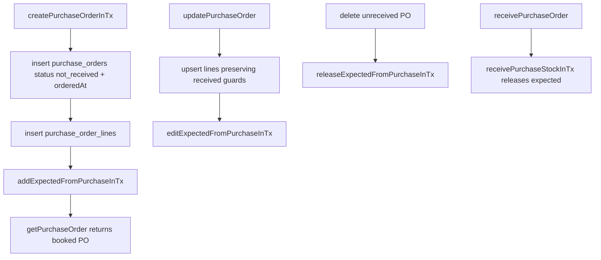

# Purchase Orders Book Expected Supply On Create

## Goal Capsule

| Field | Value |
| --- | --- |
| Objective | Make purchase orders match Katana semantics: a PO that exists is booked expected supply; `draft` no longer exists as a purchasing lifecycle state. |
| Authority | User-ratified inventory spec in the request overrides current purchasing docs and current implementation. Existing inventory-kernel rules still govern all quantity/projection writes. |
| Execution profile | Code/schema/API/UI/docs/tests/migration change in the ERP web repo, with Android contract assessment reported in the PR body. |
| Stop condition | New and migrated unreceived POs have status `not_received`, create/edit/delete/receive keep `inventory_expected_summary` and `inventory_item_balances.expected_qty` reconciled, and no web UI/API path exposes `draft` as a purchase-order status. |

## Product Contract

### Summary

Purchase order status answers only receiving progress. Creation immediately books expected supply through the canonical inventory expected-supply path. There is no separate "real yet" gate and no cancelled status.

### Problem Frame

Sales orders already book demand on creation, but purchase orders are created as `draft` and only book expected supply when submitted. The property harness found the minimal divergence: create item, create PO for quantity 1, expected remains 0. The app must change, not the spec.

### Requirements

- R1. Creating a standard purchase order through any create surface must persist it as `not_received` and book expected supply for every line in the same transaction through `addExpectedFromPurchaseInTx`.
- R2. `draft` must be removed from the purchase-order lifecycle end-to-end: schema constants, API validation, status controls, list filters, badges/tooltips, docs, and tests.
- R3. Existing `draft` purchase orders must migrate to `not_received` and receive expected-supply rows/projections equivalent to canonical booking.
- R4. Edits to every unreceived or partially received PO must keep expected supply synchronized with remaining stock quantities. Any draft-only replace-lines path must be eliminated for POs.
- R5. Deleting any unreceived booked standard PO must release expected supply in the same transaction. Partially or fully received POs remain protected from delete.
- R6. `/api/purchase-orders/:id/submit` must no longer be the booking gate. It may survive only as a named compatibility shim if a real client still needs it.
- R7. Xero purchase-order push or email flows must not depend on submit as the moment a PO becomes real.
- R8. Sales order behavior must not change.
- R9. Android impact must be checked against the sibling `erp-android` repo after reading its `CLAUDE.md`, and the PR body must report findings and any follow-up plan.
- R10. Additional-cost POs are accounting documents, not stock supply documents. They may follow the parent status for bill/email workflows, but they must not book expected inventory.

### Acceptance Examples

- AE1. Given a supplier, item, and POST `/api/purchase-orders` with one line for stock quantity 1, when the request succeeds, then the returned order status is `not_received`, `inventory_expected_summary` contains quantity 1 for that PO line, and `inventory_item_balances.expected_qty` for the item is 1.
- AE2. Given an existing `draft` PO with one line for quantity 5 before migration, when the migration runs, then the row status is `not_received`, expected summary contains 5 for the line, and item balance expected quantity includes 5.
- AE3. Given an unreceived PO with expected quantity 10, when the line is edited to quantity 7, then expected summary and item balance expected quantity become 7 without direct projection writes.
- AE4. Given an unreceived PO with expected quantity 10, when it is deleted, then the PO is soft-deleted and expected quantity is released to 0.
- AE5. Given a partially received PO, when remaining quantity is received, then expected supply is released by the existing receive path and status becomes `received`.

### Scope Boundaries

- Use `not_received` as the open post-creation status so the persisted value matches the receiving-progress label.
- Do not add `cancelled`.
- Do not redesign manufacturing-order draft/release semantics.
- Do not change sales-order demand booking.
- Do not introduce direct inventory projection writes outside the inventory kernel.
- Accept the card-kernel consequence intentionally: an autosaved new PO that the user abandons after entering a valid supplier and line is a real booked PO affecting planning. This matches the ratified "document exists is booked" semantics; cleanup is deletion, which releases expected supply.

---

## Planning Contract

### Key Technical Decisions

- KTD1. **Centralize create-time booking inside `createPurchaseOrderInTx`.** This is the single create path used by API card saves, duplication, planning actions, and accounting import helpers. Booking here keeps document-sync card creation and non-card creates consistent.
- KTD2. **Treat `not_received` as open, not submitted.** The DB default and inserted value should become `not_received`; `orderedAt` should be set on creation for compatibility with PDFs, Xero/email document dates, and existing read models that display a PO date.
- KTD3. **Convert update logic to always use the booked branch.** `updatePurchaseOrder` currently has a draft branch that hard-deletes/reinserts lines without expected sync. Remove that branch for purchase orders and use the current non-draft edit path for `not_received`, `partial`, and `received`.
- KTD4. **Make submit idempotent/no-op or delete it after mobile/API audit.** Android does not call `/api/purchase-orders/:id/submit`; it only lists, reads detail, and posts `/receive`. Web tests/helpers and status/email routes do call submit today. Prefer deleting web usage; keep the route as a short-lived compatibility shim only if implementation finds an external/mobile/legacy caller.
- KTD5. **Migration backfill must target only rows that were `draft` at migration start.** SQL cannot call the TypeScript function directly. The migration should capture currently draft standard PO line ids, convert those POs to `not_received`, create `expected_increase` events and `inventory_expected_summary` rows for only that captured draft set using the same event/reference semantics as `addExpectedFromPurchaseInTx`, then refresh affected item balances through the same projection SQL pattern used by kernel migrations. If it detects already-`not_received` or `partial` lines missing expected summary, it must fail loudly or emit an explicit migration diagnostic instead of silently repairing them; those rows are unrelated corruption evidence. `pnpm verify:inventory` is the truth gate.
- KTD6. **Xero PO push remains retired for new workflows.** `docs/xero.md` says PO push is retired and purchase bills are manual from created/received POs. Remove submit-triggered auto PO push from active flow; preserve explicit legacy retry routes only if still present for history.

### Code References

- `lib/purchasing/queries/order-write.ts` creates POs as `not_received`, books expected supply during create, syncs expected supply on every edit, and releases expected supply when deleting an unreceived PO.
- `lib/purchasing/queries/order-submit.ts` is a compatibility shim only; it no longer changes status or books expected supply.
- `lib/inventory/kernel/operations/purchasing.ts` owns `addExpectedFromPurchaseInTx`, `editExpectedFromPurchaseInTx`, and `releaseExpectedFromPurchaseInTx`.
- `app/api/purchase-orders/[id]/status/route.ts` treats status as receiving progress; `received` runs the receive path and unavailable ordering-style transitions return an explanatory error.
- `components/card-page/order-status-configs.tsx`, `app/(dashboard)/purchasing/status-badge.tsx`, `app/(dashboard)/purchasing/orders-table.tsx`, and `app/(dashboard)/purchasing/purchase-order-card.tsx` expose `not_received`, `partial`, and `received` purchasing statuses.
- `lib/schemas/purchase-orders.ts` defines `PURCHASE_ORDER_STATUSES`.
- `lib/db/schema/purchasing.ts` stores `purchase_orders.status` as a varchar defaulting to `not_received` with a check constraint for `not_received`, `partial`, and `received`.
- `lib/planning/actions.ts`, `lib/purchasing/queries/accounting-import.ts`, and `lib/purchasing/queries/additional-costs.ts` use booked-on-create purchasing semantics.
- `test/e2e/fast/purchasing-supply-and-receipt.spec.ts`, `test/e2e/slow/purchasing-receiving.spec.ts`, and `test/helpers/api.ts` exercise create-time expected supply without submit.
- Android trace: `erp-android/app/src/main/java/com/sevenfifty/erp/purchasing/PurchaseOrderApi.kt` has no submit endpoint; Android follow-up should remove Draft-tab copy and recognize `not_received` as receivable.

### High-Level Technical Design

### Sequencing

1. Start a feature worktree from fresh `origin/main` and run `pnpm boot`.
2. Add a scratch Playwright spec proving create immediately books expected supply and draft submit is gone from UI/API behavior.
3. Implement create/update/delete/status route changes around the existing inventory kernel.
4. Generate and apply the migration/backfill from fresh `origin/main`.
5. Sweep UI, docs, tests, and Android-impact notes.
6. Distill scratch coverage into fast/slow purchasing lanes, delete scratch, then run the full definition-of-done checks.

---

## Implementation Units

### U1. Create-Time Booking And Edit/Delete Semantics

- **Goal:** Make every PO booked from birth and keep expected supply synchronized through edits/deletes.
- **Requirements:** R1, R4, R5, R8.
- **Files:** `lib/purchasing/queries/order-write.ts`, `lib/purchasing/queries/accounting-import.ts`, `lib/planning/actions.ts`, `lib/purchasing/queries/additional-costs.ts`, `lib/inventory/kernel/operations/purchasing.ts` if helper shape needs minor reuse.
- **Approach:** Change `createPurchaseOrderInTx` to set `status: "not_received"`, set `orderedAt`, insert lines, then call `addExpectedFromPurchaseInTx` with inserted standard stock line ids and stock quantities before returning. Additional-cost POs must keep status parity for accounting workflows but skip expected-supply booking entirely. Make idempotent create replay safe by not rebooking when insert conflicts. Remove `order.status === "draft"` edit branch so line edits always preserve received guards and call `editExpectedFromPurchaseInTx` for booked statuses. Update delete single/bulk to release expected for any unreceived standard PO. Update planning/accounting import/additional-cost code so names and branches no longer expect newly created standard POs to be `draft`.
- **Test scenarios:** Create PO with one line and assert status `not_received`, expected summary, and item balance expected quantity. Replay same client-id create and assert no duplicate expected event/summary. Edit quantity up/down before receipt and assert expected changes. Delete unreceived PO and assert expected release. Duplicate PO and assert duplicate is also booked once. Create/materialize an additional-cost PO and assert no expected summary/event/balance change is created for it.
- **Verification:** `pnpm test:scratch` during implementation, then `pnpm test:fast:purchasing` and `pnpm verify:inventory`.

### U2. Submit Route And Status Transition Cleanup

- **Goal:** Remove submit as a lifecycle/booking gate while preserving only intentional compatibility.
- **Requirements:** R2, R6, R7.
- **Files:** `lib/purchasing/queries/order-submit.ts`, `app/api/purchase-orders/[id]/submit/route.ts`, `app/api/purchase-orders/[id]/status/route.ts`, `app/api/purchase-orders/[id]/email/route.ts`, `lib/api/clients/purchase-orders.ts`, `test/helpers/api.ts`.
- **Approach:** Remove web usage of submit for promoting draft purchase orders. The status route should reject ordering-style transitions because status now only tracks receiving progress; receiving remains the only actionable status transition. The email route should flush/use the existing PO directly rather than auto-submit. If the route survives, rename the function semantics in code comments to `compatSubmitPurchaseOrder` or equivalent and make it idempotently return `{ id }` for existing `not_received` POs without booking. If no caller remains, delete route/function/helper.
- **Test scenarios:** PATCH status to an unavailable ordering state returns an explanatory receiving-progress error or is not offered from UI. POST submit, if retained, does not create duplicate expected events. Email/PDF/bill actions still work on a newly created PO without submit.
- **Verification:** Fast purchasing tests and any Xero purchase bill gate tests that previously called submit.

### U3. Schema, Validation, Migration, And Backfill

- **Goal:** Remove `draft` from persisted purchasing status values and backfill expected supply for existing draft rows.
- **Requirements:** R2, R3, R5.
- **Files:** `lib/db/schema/purchasing.ts`, `lib/schemas/purchase-orders.ts`, generated `drizzle/*`, `drizzle/meta/*`.
- **Approach:** Change status default to `not_received` and remove `draft` from `PURCHASE_ORDER_STATUSES`. Use `pnpm db:generate`, then patch generated SQL as needed. Migration should first capture active rows currently in `draft`; update those standard/additional-cost POs to `not_received`, set `ordered_at` where null, and backfill expected supply only for captured draft standard PO lines. It must not heal already-`not_received` or `partial` POs missing expected summary; fail or log those as corruption evidence for explicit follow-up. Ensure summary quantities equal `stock_quantity_ordered - stock_quantity_received` for the captured draft standard lines and item balance expected quantities reconcile with summaries. Additional-cost POs are converted to `not_received` but receive no expected-supply rows. Do not create cancelled status. Make the backfill/sweep idempotent and run it once after the deploy settles so POs created by old code during the migration-to-deploy window are also converted/booked.
- **Test scenarios:** Seed or scratch-create a pre-migration draft-like row in a throwaway test DB path if practical, run migration, and assert status/expected summary/balance. Assert an additional-cost PO is status-converted but books no expected supply. Assert, where practical, that an already-booked line missing expected summary is detected rather than repaired. At minimum, add SQL comments and validate through `pnpm verify:inventory` after migration and after the post-deploy sweep.
- **Verification:** `pnpm db:generate`, `pnpm drizzle-kit migrate`, `pnpm build`, `pnpm verify:inventory`.

### U4. Web UI Status And Card Flow

- **Goal:** Remove draft/submit UI from purchasing while preserving receive progress actions.
- **Requirements:** R2, R4, R5.
- **Files:** `components/card-page/order-status-configs.tsx`, `app/(dashboard)/purchasing/status-badge.tsx`, `app/(dashboard)/purchasing/orders-table.tsx`, `app/(dashboard)/purchasing/purchase-order-card.tsx`, `app/(dashboard)/purchasing/use-purchase-order-draft-controller.ts`, `lib/tooltip-copy.ts`, `lib/dashboard-navigation.ts`.
- **Approach:** Status options should be `not_received`, `partial`, `received`; remove cancelled from PO options if it is only a stale display option. New-card local placeholder may still be an unsaved client draft internally, but the first successful card-kernel autosave creates a real `not_received` PO and books expected supply. This is accepted product behavior: abandoning the card after a valid autosave leaves a booked PO, and deleting it is the release path. Delete action should be available for `not_received` only before receipt; copy should create a booked order. Remove draft filters/navigation text and update confirmation copy.
- **Test scenarios:** Create a PO from the card page and verify the header/list shows `Not received` without a submit action. Autosave a new PO with a supplier and line, navigate away, and assert it remains a booked expected-supply PO. Receive dialog remains available for not received/partial only. Delete confirmation copy says expected supply will be released for unreceived POs. No visible Draft purchase-order filter remains.
- **Verification:** Scratch UI screenshot pass per `docs/ui-review-checklist.md`, then `pnpm review <path> --slow purchasing`.

### U5. Xero, Accounting, Planning, And Agent References

- **Goal:** Keep adjacent workflows consistent with booked-on-create semantics.
- **Requirements:** R6, R7.
- **Files:** `lib/xero/push-purchase-order.ts`, `lib/xero/retry-failed-pushes.ts`, `lib/purchasing/send-purchase-order-email.tsx`, `lib/pdf/purchase-order-document.tsx`, `lib/agent/chat/actions/purchasing.ts`, `lib/agent/chat/read-tools.ts`, `lib/agent/production-planning-context/service.ts`, `lib/planning/service.ts`, `lib/planning/actions.ts`, `lib/inventory/allocation/demand-queue.ts`, `lib/sales/fulfillment-read-model.ts`, `lib/agent/replenishment-context/service.ts`.
- **Approach:** Replace active PO filters with `["not_received", "partial"]` where they mean expected supply. Remove `draft` from active material/supplier delete blockers where no persisted draft remains. Keep manufacturing draft semantics intact. For Xero, ensure manual purchase bill creation remains allowed on newly created not received POs and that retired PO push is not automatically triggered by creation unless product explicitly wants that lifecycle point.
- **Test scenarios:** Planning-created PO is immediately expected supply and duplicate recommendation checks still prevent duplicate active POs. Supplier/item delete blockers still block active not received/partial POs. Purchase bill gate tests pass without submit.
- **Verification:** `pnpm test:fast:purchasing`, `pnpm test:fast:planning` if planning expected-supply behavior changes, and Xero manual smoke note if Xero code changes.

### U6. Tests And Documentation

- **Goal:** Distill the new invariant into permanent tests and align operator/developer docs.
- **Requirements:** R1, R2, R3, R9.
- **Files:** `test/e2e/scratch/*` temporary, `test/e2e/fast/purchasing-supply-and-receipt.spec.ts`, `test/e2e/fast/xero-purchase-bill-gates.spec.ts`, `test/e2e/slow/purchasing-receiving.spec.ts`, `test/e2e/fast/FAST_TEST_SEAMS.md`, `test/e2e/slow/SLOW_TEST_STORIES.md`, `docs/purchasing.md`, `docs/database.md`, `docs/xero.md`, `docs/slow-suite-audit.md`, `docs/small-scale-mrp-roadmap.md`, `apps/www/src/content/docs/reference/purchase-order-statuses.md`, `apps/www/src/content/docs/reference/inventory-statuses.md`, `apps/www/src/content/docs/reference/delete-rules.md`, `apps/www/src/content/docs/reference/api-reference.md`, `apps/www/src/content/docs/how-to/receive-inventory.md`, `apps/www/src/content/docs/how-to/delete-a-purchase-order.md`, `apps/www/src/content/docs/concepts/planned-vs-unplanned-demand.md`, `apps/www/src/content/docs/concepts/inventory.md`, `apps/www/src/content/docs/start-here/erp-overview.md`.
- **Approach:** Start with a scratch spec that fails on current main: POST `/api/purchase-orders` immediately yields expected quantity. After green, update the former submit-gated fast seam test to assert create-time booking. Update slow purchasing story from create/submit/receive to create/receive. Remove or rewrite helper `submitPurchaseOrder` usages. Sweep docs for draft/submit wording.
- **Test scenarios:** Permanent fast invariant is AE1. Slow story covers human workflow: create not received PO, send documents, partial/final receive, expected becomes physical stock. Xero bill gate tests cover bill creation on created not received POs without submit.
- **Verification:** `pnpm test:scratch` red/green then delete scratch, `pnpm test:fast:purchasing`, `pnpm test:slow:purchasing`.

### U7. Android Contract Report

- **Goal:** Satisfy the mobile contract rule and name Android follow-up work.
- **Requirements:** R9.
- **Files:** No ERP code required unless API compatibility changes; PR body must mention Android findings. Android follow-up likely touches `erp-android/app/src/main/java/com/sevenfifty/erp/purchasing/PurchaseOrderListScreen.kt`, `PurchaseOrderListViewModel.kt`, `PurchaseOrderModels.kt`, and related tests.
- **Approach:** Spawn a subagent during implementation to read `erp-android/CLAUDE.md` first and trace PO status/submit usage. Planning-time trace found no Android submit endpoint call in `PurchaseOrderApi.kt`; Android depends on `draft` only as a Receive list filter/status bucket and fallback copy. Since server-created POs will no longer be draft, Android should keep working for receiving, but should remove the Draft tab/copy in a separate Android PR and recognize `not_received`.
- **Test scenarios:** Android list contract accepts `not_received`, `partial`, `received` and no longer expects `draft` rows. Receive remains enabled for `not_received`/`partial`.
- **Verification:** ERP PR body records the mobile trace and compatibility plan. Android PR, if pursued, runs `./gradlew test`, `./gradlew assembleDebug`, and `./gradlew verifyTestRegistries`.

---

## Verification Contract

| Command / Check | Applies To | Done Signal |
| --- | --- | --- |
| `pnpm boot` | Start feature workflow in a non-main worktree | Local DB/server/session ready. |
| `pnpm test:scratch` | Scratch-first invariant and UI screenshot pass | Fails before implementation, passes after; scratch files deleted before PR. |
| `pnpm db:generate` + `pnpm drizzle-kit migrate` | Schema/default/backfill | Migration generated from fresh `origin/main` and applied locally. |
| `pnpm build` | Whole app | Type/build clean. |
| `pnpm lint` | Whole app | Lint clean. |
| `pnpm test:fast:purchasing` | Purchasing mutation seam | Create-time expected supply and edit/delete/receive invariants pass. |
| `pnpm test:slow:purchasing` | Purchasing operating story | Create/send/receive/revalue story passes without submit. |
| `pnpm verify:inventory` | Inventory-affecting change | Kernel guards and projection diff clean. |
| `pnpm review <path> --slow purchasing` | PR/open review | PR opened ready, Paonia data seeded, browser left on a page showing newly created PO counted as expected stock. |
| `no-mistakes axi run --yes --intent "<POs book expected supply on create and draft is removed>"` | After PR opens | Findings addressed before done. |

---

## Definition of Done

- Every create path that persists a standard PO books expected supply in the same transaction through the purchasing inventory kernel.
- No persisted purchase order has status `draft` after migration; new rows default to `not_received`.
- The migration/backfill only books rows captured as `draft`; not received/partial expected-summary gaps are surfaced, not silently repaired, and the idempotent sweep is rerun after deploy settles.
- Additional-cost POs are status-converted but never book expected inventory.
- No web UI, API validation, docs, or tests describe purchase-order draft/submit as the normal lifecycle.
- Submit is deleted or explicitly retained as a compatibility shim with no booking role and no duplicate expected events.
- Edit, receive, delete, planning, accounting import, and duplicate flows keep expected supply reconciled.
- Android findings and follow-up plan are recorded in the PR body.
- Scratch specs are deleted; permanent purchasing fast/slow tests carry the essential invariant.
- `pnpm build`, `pnpm lint`, `pnpm test:fast:purchasing`, `pnpm test:slow:purchasing`, and `pnpm verify:inventory` pass.
- PR has `ci:slow:purchasing`, then `ci:ready`, and is ready for review.
